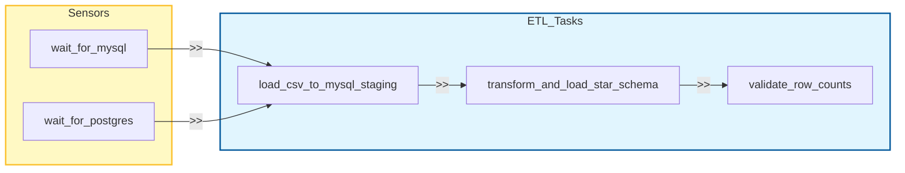

# Flight Price Analysis Pipeline

A robust, containerized **End-to-End ELT Pipeline** that ingests flight data, stages it in MySQL, and transforms it into a Star Schema in PostgreSQL for high-performance analytics. Orchestrated by **Apache Airflow**.

## 🚀 Project Overview

This project implements a **Modern Data Stack (MDS)** to analyze flight prices. It simulates a production-grade data engineering workflow where raw data is ingested, staged, and then transformed into a dimensional model suitable for Business Intelligence (BI) tools.

### Key Features

- **Containerized Architecture**: Fully Dockerized environment (Airflow, MySQL, PostgreSQL).
- **Automated orchestration**: Daily scheduled workflows using Airflow DAGs.
- **ELT Strategy**: "Extract-Load-Transform" pattern for flexibility and performance.
- **Dimensional Modeling**: Implementation of a Star Schema (Fact & Dimensions).
- **Infrastructure as Code**: Database schemas initialized via SQL scripts.

---

## 🏗️ Architecture

The pipeline follows a linear data flow orchestrated by the `flight_price_pipeline` DAG.




### Pipeline Workflow (`flight_price_pipeline`)

The Airflow DAG consists of two primary PythonOperator tasks:

1.  **`load_csv_to_mysql_staging`**:
    - **Input**: `data/Flight_Price_Dataset_of_Bangladesh.csv`
    - **Action**: Reads CSV, standardizes column names (snake_case), and loads raw data into MySQL.
    - **Output**: `staging_flight_data.raw_flight_data` (MySQL).

2.  **`transform_and_load_star_schema`**:
    - **Input**: Raw data from MySQL.
    - **Action**: Extracts data, performs dimensional modeling (separating logic for Airlines, Airports, Dates), and creates the Fact table.
    - **Output**: `analytics` schema tables in PostgreSQL (`fact_flights`, `dim_airlines`, etc.).

---

## 💾 Database Schema (Star Schema)

The Analytics layer in PostgreSQL is designed as a **Star Schema** to optimize read performance for analytical queries.


### Table Details

- **`fact_flights`**: Contains metrics like `total_fare`, `duration_hours`, and keys to dimensions.
- **`dim_airlines`**: Cleanup up list of airline names.
- **`dim_airports`**: Maps IATA codes (e.g., DAC) to full airport names.
- **`dim_date`**: Derived calendar attributes (Year, Month, Weekend flag) for time-series analysis.

---

## 📊 Data Insights & Visualizations

The pipeline feeds into a BI dashboard that tracks key metrics such as average fare by airline, booking trends, and route popularity.


### Key Metrics

|                    Average Fare by Airline                     |               Booking Count by Airline                |
| :------------------------------------------------------------: | :---------------------------------------------------: |
|  |  |

|              Fare Trend Over Time              |               Most Popular Route                |
| :--------------------------------------------: | :---------------------------------------------: |
|  |  |

---

## 🛠️ Technology Stack

| Component            | Technology                                                                                                               | Description                               |
| :------------------- | :----------------------------------------------------------------------------------------------------------------------- | :---------------------------------------- |
| **Orchestrator**     |  | Schedules and monitors the pipeline.      |
| **Language**         |                       | Core logic for ETL tasks (Polars/Pandas). |
| **Staging DB**       |                          | Intermediate storage for raw data.        |
| **Data Warehouse**   |           | Final storage for analytical tables.      |
| **Containerization** |                       | Ensures consistent environments.          |

---

## 🏁 Getting Started

### Prerequisites

- **Docker Desktop** installed and running.
- **Git** installed.

### Installation

1.  **Clone the Repository**

    ```bash
    git clone https://github.com/your-username/airflow-flight-analysis.git
    cd airflow-flight-analysis
    ```

2.  **Environment Setup**
    Create a `.env` file in the root directory (or rename `.env.example`).

    ```bash
    cp .env.example .env
    ```

    _Ensure `AIRFLOW_UID` is set (usually 50000 on data sources)._

3.  **Launch Services**
    Initialize the database and start Airflow.

    ```bash
    docker-compose up -d --build
    ```

4.  **Access Airflow UI**
    - Wait for the containers to be healthy.
    - Open browser: [http://localhost:8080](http://localhost:8080)
    - **Username/Password**: `airflow` / `airflow`

### Running the Pipeline

1.  In the Airflow UI, find `flight_price_pipeline`.
2.  Toggle the DAG to **ON**.
3.  Click the **Trigger DAG** (Play button) to start a manual run.
4.  Monitor the `Graph` view to watch tasks execute.

5.  **Access Metabase UI**
    - Wait for the containers to be healthy.
    - Open browser: [http://localhost:3000](http://localhost:3000)
    - **Username/Password**: `[EMAIL_ADDRESS]` / `[New Password]`
    - **Database**: `postgres`
    - **Port**: `5432`
    - **Username**: `analytics_user`
    - **Password**: `[password used in .env file for postgres]`

6.  **Access DbGate UI**
    - Wait for the containers to be healthy.
    - Open browser: [http://localhost:3000](http://localhost:3000)
    - **Username/Password**: `[db_credentials in .env]` / `[db_credentials in .env]`

---

## 📂 Project Structure

```bash
├── dags/
│   ├── flight_pipeline_dag.py    # Main Airflow DAG Orchestrator
│   └── tasks/                    # Modular Task Logic
│       ├── ingestion.py          # Extraction & Staging Logic
│       ├── transformation.py     # Star Schema Transformation Logic
│       └── validation.py         # Data Integrity Checks
├── data/
│   └── ...csv                    # Source dataset
├── scripts/
│   ├── init_mysql.sql            # Staging table DDL
│   └── init_postgres.sql         # Analytics schema DDL
├── config/                       # Airflow configurations
├── docker-compose.yaml           # Container services definition
└── README.md                     # Project documentation
```
